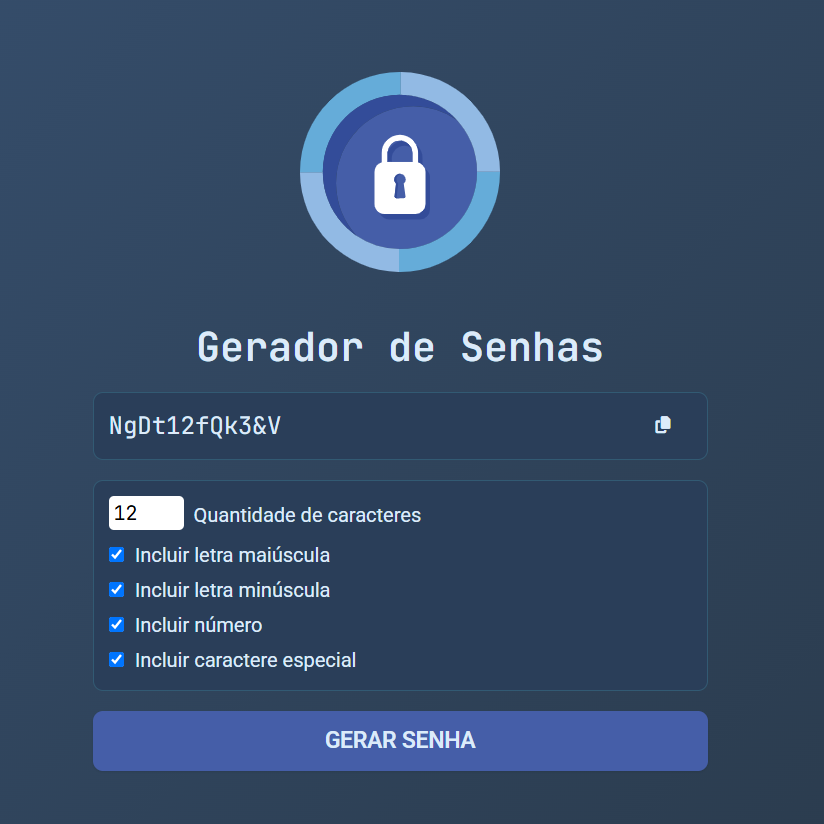

# Gerador de Senhas

Um simples e funcional gerador de senhas feito com HTML, CSS e JavaScript puro. Permite ao usuário personalizar a quantidade de caracteres, incluir letras maiúsculas, minúsculas, números e caracteres especiais.

## Funcionalidades

- Geração de senhas aleatórias
- Opções de personalização:
    - Letras maiúsculas
    - Letras minúsculas
    - Números
    - Caracteres especiais
- Campo de cópia rápida da senha gerada
- Interface responsiva e moderna

## Demonstração

[Clique aqui para ver o projeto em funcionamento](https://senhas-seguras.netlify.app/)

## Captura de Tela

## Tecnologias utilizadas

- HTML5
- CSS3
- JavaScript

## Como utilizar localmente

1. Clone o repositório:
`git clone https://github.com/matheushnt/gerador-de-senhas.git`
2. Acesse a pasta:
`cd gerador-de-senhas`
3. Abra o `index.html` no navegador.
